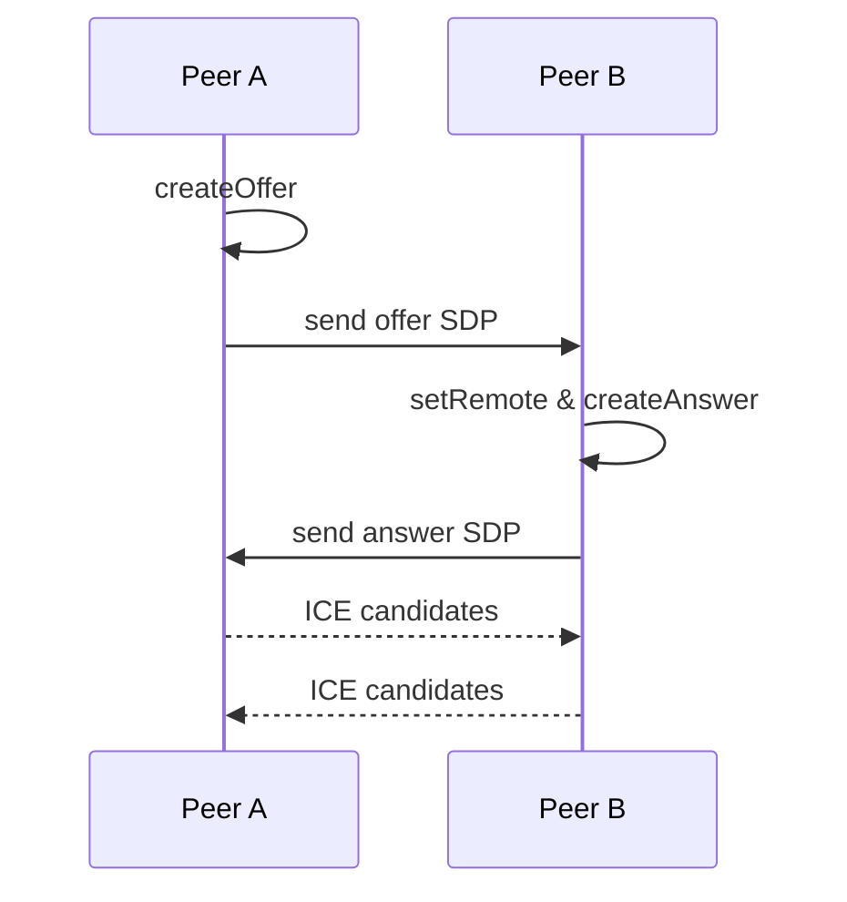

# Case Study: Video Call (WebRTC)

Designing a browser-based video conference: capture, encode, transport, and render.

## RADIO+
- Requirements: multi-party, mute/camera control, screen share, recording
- API/Data: signaling (offer/answer/ICE), TURN/STUN, media constraints
- Interface: device selection, permissions UX, grid layout, a11y
- Operations: bandwidth adaptation, simulcast/SVC, rejoin flows
- Risks: permissions denied, NAT traversal issues, device quirks
- Observability/Testing: media quality metrics, reconnect tests

## Examples
- [examples/getUserMedia.ts](./examples/getUserMedia.ts)
- [examples/webrtc-offer-answer.ts](./examples/webrtc-offer-answer.ts)

## Checklist
- Permissions UX for camera/mic/screen
- TURN availability for NAT traversal
- Bandwidth adaptation (simulcast/SVC)
- Device selection and fallback paths
- Rejoin/reconnect flows defined

## Diagram: Offer/Answer Negotiation

## Trade-offs

| Topic | Option | Pros | Cons | Prefer when |
|------|--------|------|------|-------------|
| Topology | P2P | Lower infra cost | Quality drops with >2 peers | 1:1 calls |
| Topology | SFU | Scales to many peers | Infra cost, server complexity | Group calls |
| Media | Simulcast | Adapts to bandwidth | More CPU/bandwidth | Heterogeneous clients |
