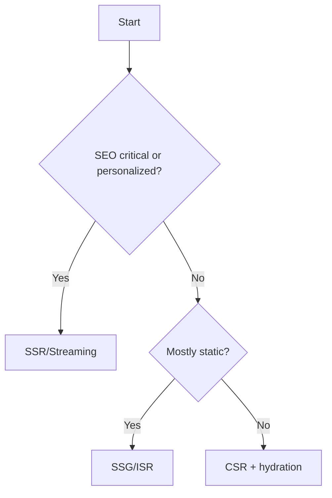

# RADIO+ Framework for Front-End System Design

Use this structure to answer design questions clearly and consistently. Terms are expanded on first use and listed in the [Glossary](./GLOSSARY.md).

Abbreviations used below (expanded on first mention):
- Core Web Vitals (CWV), Real User Monitoring (RUM), Service Worker (SW), Content Delivery Network (CDN)
- Client-Side Rendering (CSR), Server-Side Rendering (SSR), Static Site Generation (SSG), Incremental Static Regeneration (ISR)
- Service Level Objective (SLO), eXecute Disable/Exploit terms like Cross‑Site Scripting (XSS), Cross‑Site Request Forgery (CSRF)

## 1) Requirements
Define success before picking technology.

- Functional: core flows, data entities, user roles, internationalization (i18n)
- Non-functional: performance targets (Core Web Vitals, CWV), accessibility (a11y) baseline (e.g., WCAG), security posture, availability, privacy
- Constraints: devices, network conditions, offline expectations, search engine optimization (SEO), need for server-side rendering (SSR)

Deliverables:
- User stories and acceptance criteria per flow
- SLOs (Service Level Objectives), e.g., LCP < 2.5s p75, INP < 200ms p75, CLS < 0.1 p75
- Target platforms (mobile/desktop), locales, offline scope

Questions to ask:
- What are the critical user journeys (happy path and errors)?
- Are SEO and social sharing required? Personalized content?
- What are performance and availability targets? Any privacy/regulatory constraints?

Anti‑patterns:
- Jumping to tech (e.g., SSR) without explicit SEO/personalization requirements
- Vague "fast enough" goals without CWV budgets

## 2) API/Data
Decide how data is shaped, delivered, cached, and versioned.

- Contracts: REST or GraphQL; standard error model; pagination (cursor vs offset)
- Consistency & versioning: strong vs eventual; semantic versioning for APIs; idempotency for mutations
- Caching directives: HTTP Cache‑Control/ETag; surrogate keys at CDN; client cache policy
- Validation and schema: TypeScript types, runtime schema validation (e.g., Zod)
- Payload budgets: JSON size limits; avoid overfetching; compression

Deliverables:
- API contract (paths or GraphQL operations), error taxonomy, example payloads
- Pagination spec (e.g., cursor with `nextCursor`), idempotency keys behavior
- Cache policy table (TTL, SWR window, revalidation triggers)

Questions to ask:
- What’s the canonical error shape? How do clients distinguish retryable vs fatal?
- What are data freshness requirements? Can we tolerate staleness (SWR)?
- How will contracts evolve without breaking old clients?

Anti‑patterns:
- Free‑form errors, no pagination policy, no idempotency on write operations

## 3) Interface
Design UI states, accessibility, and reusability before implementation.

- UX states: loading, empty, error, success; optimistic updates; skeletons vs spinners
- Accessibility (a11y): keyboard navigation, focus management, ARIA semantics
- Internationalization (i18n): locale switch, plurals, RTL support
- Component APIs: headless primitives vs themed components; composition; tokens/theming

Deliverables:
- State diagram per core component/flow
- Component API (props/events) and usage examples
- A11y notes (roles, keyboard behavior, focus strategy)

Questions to ask:
- What is the empty state? How do we communicate partial failures?
- What is the minimum keyboard interaction model? Screen reader expectations?
- What tokens/themes are required (light/dark, brand variants)?

Anti‑patterns:
- Hidden loading states; no keyboard support; inaccessible dialogs/menus

## 4) Operations
How the app runs in production: rendering, caching, deployment, and performance.

- Rendering model: CSR/SSR/SSG/ISR/Streaming; edge vs origin rendering strategy
- Data strategies: preload, prefetch, revalidate, Stale‑While‑Revalidate (SWR), background sync via Service Worker (SW)
- Performance: code splitting (route/component), image formats (AVIF/WebP), font subsetting
- Delivery: CDN caching, cache keys, invalidation; environment configuration; feature flags

Deliverables:
- Rendering matrix per route (e.g., PDP = SSR, dashboard = CSR)
- Caching plan (HTTP + client + SW), prefetch map, image/font strategy
- Build/deploy overview (bundler, environment variables, rollouts)

Questions to ask:
- Which routes truly need SSR (SEO or per‑user content)?
- What is our cache hierarchy (browser, CDN, server) and invalidation story?
- Which assets dominate CWV? Do we have budgets and monitoring?

Anti‑patterns:
- One‑size‑fits‑all rendering; no cache plan; ignoring image/font impact on CWV

## 5) Risks & Trade-offs
Make trade‑offs explicit and record rejected options.

- Decision matrix template:

| Option | Pros | Cons | Decision |
|--------|------|------|----------|
| A | … | … | Accepted/Rejected |
| B | … | … | … |

- Common trade‑offs: CSR vs SSR; Cursor vs Offset pagination; Cookies (HttpOnly) vs localStorage tokens; Network‑first vs SWR caching

Deliverables:
- Short decision log with 2–3 key choices and rationale

## 6) Observability & Testing
Measure user experience (RUM), track errors, and enforce quality with tests.

- Instrumentation: Real User Monitoring (RUM) for CWV (LCP/INP/CLS); logs/metrics/traces
- Alerting: SLOs and thresholds (e.g., error rate, LCP p75); dashboards
- Testing pyramid: unit, component, contract/API, end‑to‑end (E2E); performance budgets in CI

Deliverables:
- RUM hooks for CWV; error tracking integration; dashboards and alerts
- Test plan: coverage goals; critical path E2E; contract tests for API schemas

Questions to ask:
- Which metrics define "healthy" for this app? What are alert thresholds?
- Where do we correlate client traces with backend traces?
- Which journeys are in the E2E smoke suite? What are performance gates?

Anti‑patterns:
- Metrics without alerts; E2E without contract tests; no CWV instrumentation

## 7) Checklists
Keep short and actionable. Example:

```md
- Requirements captured, SLOs defined
- API contracts and error model agreed
- UX states and a11y behaviors enumerated
- Rendering and caching strategy selected
- Performance budgets set; critical paths optimized
- Security threats mitigated (XSS/CSRF/CSP)
- Observability hooks in place; alerts defined
- Tests and acceptance criteria in place
```

## Example Decision Tree (Rendering)



## RADIO+ Cheatsheet (Outputs)
- Requirements doc with SLOs (LCP/INP/CLS) and constraints
- API contract with error taxonomy, pagination, idempotency, cache policy
- UI state maps + a11y notes + component API
- Operations plan: rendering per route, cache hierarchy, asset strategy, deploy
- Decision log with trade‑offs
- Observability plan (RUM, alerts, dashboards), testing plan (unit→E2E)


