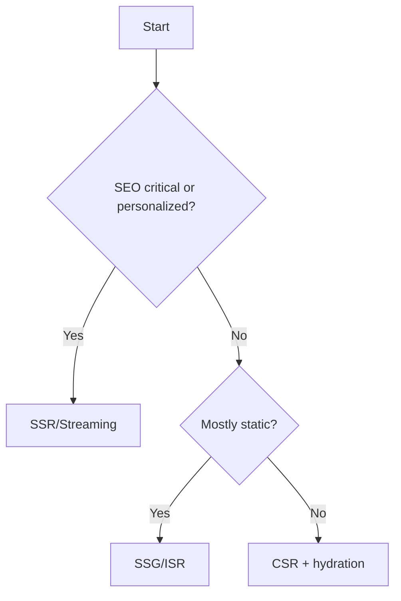

# RADIO+ Framework for Front-End System Design

Use this structure to answer design questions clearly and consistently.

## 1) Requirements
- Functional: core flows, data entities, user roles, internationalization
- Non-functional: performance targets (CWV), accessibility baseline, security posture, availability, privacy
- Constraints: devices, network conditions, offline expectations, SEO, SSR needs

## 2) API/Data
- Contracts (REST/GraphQL), pagination style, error model
- Consistency levels, versioning, idempotency, caching directives
- Validation and schema (Zod/TypeScript), serialization cost

## 3) Interface
- UX primitives and states (loading/empty/error/success)
- Accessible patterns (keyboard nav, focus, ARIA)
- Design tokens, theming, and component APIs

## 4) Operations
- Rendering model (CSR/SSR/SSG/ISR/Streaming, edge vs origin)
- Data strategies (preload, prefetch, revalidate, SWR)
- Bundling/splitting, images/fonts, CDN, configuration

## 5) Risks & Trade-offs
- Enumerate explicit trade-offs and rejection reasons
- Show a small decision matrix for contentious choices

## 6) Observability & Testing
- RUM and CWV instrumentation, logs/metrics/traces
- Error tracking strategy, feature flags, A/B rollout
- Test pyramid (unit, component, contract, e2e) and budgets

## 7) Checklists
- Keep short and actionable. Example:

```md
- Requirements captured, SLOs defined
- API contracts and error model agreed
- UX states and a11y behaviors enumerated
- Rendering and caching strategy selected
- Performance budgets set; critical paths optimized
- Security threats mitigated (XSS/CSRF/CSP)
- Observability hooks in place; alerts defined
- Tests and acceptance criteria in place
```

## Example Decision Tree (Rendering)




