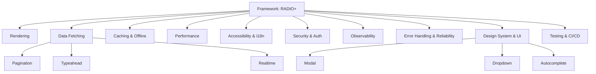

# Front-End System Design Showcase

Welcome to the showcase. This site mirrors the repository content with a navigable index, diagrams, and links.

## How to use this site
- Start with the framework: [`RADIO.md`](./RADIO.md)
- Jump into topic guides under [systems](../systems/) (links below)
- Browse component patterns and case studies for end-to-end design

## Topical Map

## Quick Links
- Framework: [`RADIO.md`](./RADIO.md)
- Template: [`RADIO-TEMPLATE.md`](./RADIO-TEMPLATE.md)
- Glossary: [`GLOSSARY.md`](./GLOSSARY.md)
- Contributing: [`CONTRIBUTING.md`](./CONTRIBUTING.md)
- Sources: [`SOURCES.md`](./SOURCES.md)
- Interview Guide: [`INTERVIEW_GUIDE.md`](./INTERVIEW_GUIDE.md)
- Decision Tables: [`DECISION_TABLES.md`](./DECISION_TABLES.md)
- Case Study: Video Call — [Open](../case-studies/video-call/README.md)
- Case Study: Kanban — [Open](../case-studies/kanban/README.md)

## Attribution
Inspired by multiple public resources, engineering blogs, and web standards documentation.

