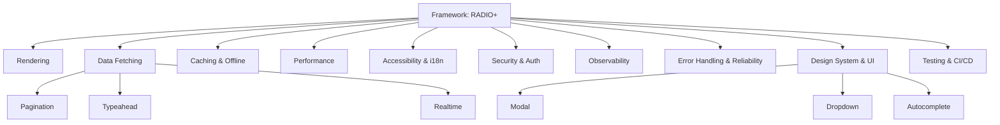

# Front-End System Design Showcase

Welcome to the showcase. This site mirrors the repository content with a navigable index, diagrams, and links.

## How to use this site
- Start with the framework: [`RADIO.md`](./RADIO.md)
- Jump into topic guides under `systems/` (links below)
- Browse component patterns and case studies for end-to-end design

## Topical Map

## Quick Links
- Framework: [`RADIO.md`](./RADIO.md)
- Glossary: [`GLOSSARY.md`](./GLOSSARY.md)
- Contributing: [`CONTRIBUTING.md`](./CONTRIBUTING.md)
 - Case Study: Video Call — `../case-studies/video-call/README.md`
 - Case Study: Kanban — `../case-studies/kanban/README.md`

## Attribution
Inspired by and extends the curated resources in
[greatfrontend/awesome-front-end-system-design](https://github.com/greatfrontend/awesome-front-end-system-design?tab=readme-ov-file).

