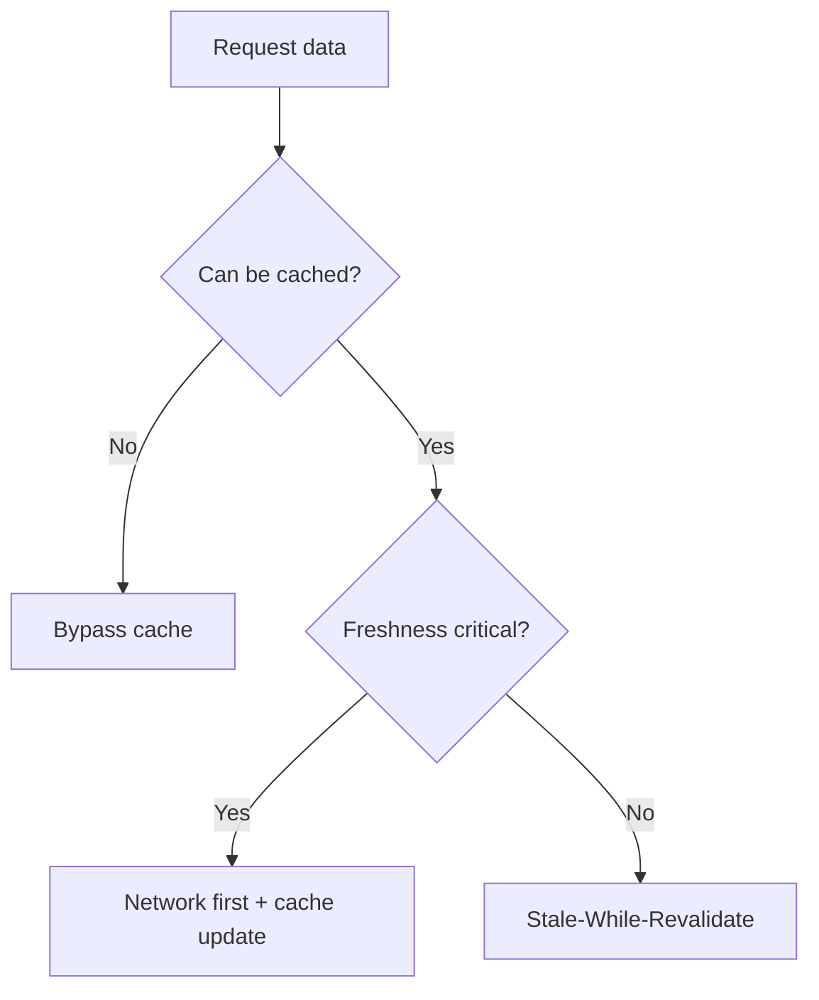

# Caching & Offline

HTTP caching, client caches, and Service Worker strategies for resilience and speed.

## RADIO+
- Requirements: freshness vs consistency, offline expectations, storage budgets
- API/Data: cacheability (Cache-Control, ETag), invalidation, versioning
- Interface: offline/online UI, stale indicators, conflict resolution
- Operations: SWR, prefetching, service worker, background sync
- Risks: stale data, cache poisoning, storage eviction
- Observability/Testing: cache hit ratios, offline success rates
- Checklist: below

## Strategy selection

## Checklist
- Define TTL/SWR for key resources
- Set Cache-Control and ETag semantics
- Service worker registration and update strategy
- Background sync for mutations
- Storage quotas and eviction handling

## Examples
- [examples/sw-staleWhileRevalidate.ts](./examples/sw-staleWhileRevalidate.ts)

## Trade-offs

| Strategy      | Pros                                 | Cons                              | Prefer when |
|---------------|--------------------------------------|-----------------------------------|-------------|
| Network-first | Fresh data priority                   | Slower on flaky networks          | Critical freshness |
| Cache-first   | Fast responses, offline-friendly      | Risk of staleness                 | Rarely-changing assets |
| SWR           | Good UX: fast + behind-the-scenes upd.| Requires revalidation plumbing    | Feeds, dashboards |
| Precache SW   | Instant load for core shell           | Update complexities               | App shell PWA |

## Sources
- More links: [docs/SOURCES.md](../../docs/SOURCES.md)
