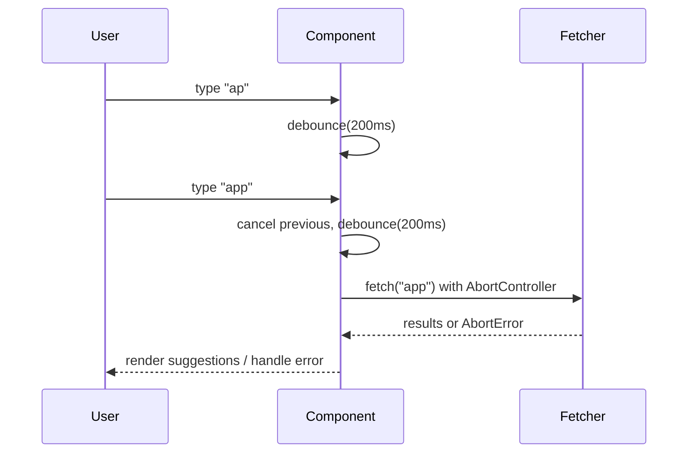

# Data Fetching (REST/GraphQL, pagination, typeahead, realtime)

Focus on contracts, pagination, cancellation, and consistency.

## RADIO+
- Requirements: freshness, latency targets, offline tolerance
- API/Data: pagination model (cursor vs offset), errors, idempotency
- Interface: loading/empty/error states, optimistic UX
- Operations: caching (HTTP + client), retries, backoff, dedupe
- Risks: overfetching, cache staleness, race conditions
- Observability/Testing: request metrics, error rates, contract tests
- Checklist: below

## Typeahead flow (debounce + cancel)

## Checklist
- Define pagination and error model
- Implement cancellation via `AbortController`
- Add retry with backoff and jitter
- Prefer cache-aware fetch layer (SWR/Suspense-ready)
- Validate inputs/outputs (Zod/TS)

## Examples
- `examples/usePaginatedFeed.ts`
- `examples/typeahead.ts`

## Trade-offs

| Topic        | Option             | Pros                          | Cons                            | Prefer when |
|--------------|--------------------|-------------------------------|---------------------------------|-------------|
| Pagination   | Cursor             | Stable under inserts/deletes  | Requires backend support         | Feeds, chats |
| Pagination   | Offset             | Simple to implement           | Skips/duplicates under changes  | Small, static-ish lists |
| Transport    | REST               | Ubiquitous, cacheable         | Over/under-fetching             | Simple resources |
| Transport    | GraphQL            | Precise fields, batching      | Extra gateway/service complexity| Complex shapes |
| Realtime     | WebSocket          | Bidirectional, low latency    | Connection mgmt                 | Interactive apps |
| Realtime     | SSE                | Simple server push            | Downstream-only                 | Broadcast/feed |

## Sources
- More links: [docs/SOURCES.md](../../docs/SOURCES.md)
