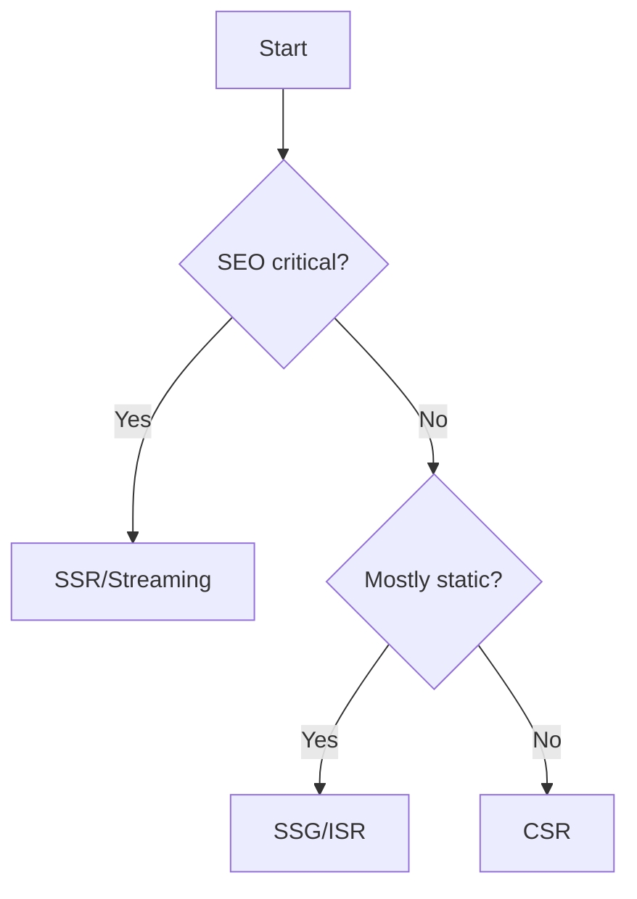

# Rendering Models (React + Vite/SSR options)

Use this guide to choose between CSR, SSR, SSG, ISR, and streaming. Vite powers client builds; use a compatible SSR framework (e.g., Next.js or Vite SSR setups) where needed.

## RADIO+
- Requirements: SEO, personalization, TTFB vs interactivity, cacheability
- API/Data: data shape at render time vs client time; hydration payload size
- Interface: skeletons/placeholder strategies, progressive disclosure
- Operations: CDN/edge, pre-rendering, revalidation, cache keys
- Risks: double-fetch, hydration mismatch, cold starts
- Observability/Testing: CWV, TTFB/INP tracking, synthetic + RUM
- Checklist: see below

## Decision flow

## Checklist
- Define SEO and personalization requirements
- Choose rendering model and justify trade-offs
- Hydration strategy (islands, partial, or full)
- Data prefetching/prefetch headers
- Image/font loading strategy
- Measure CWV; set budgets

## Examples
- `examples/next-streaming.tsx` — streaming SSR route component (conceptual)
