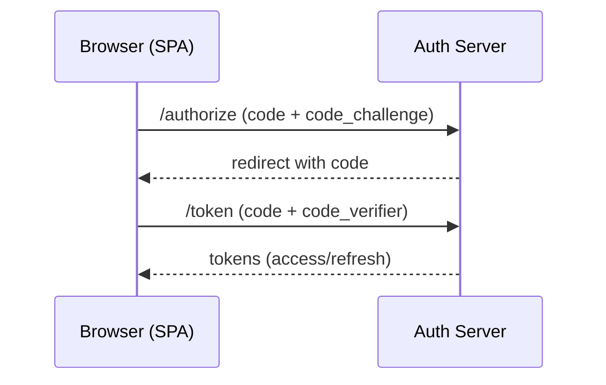

# Security & Authentication

Threat model your UI; prevent XSS/CSRF; choose OAuth/OIDC/PKCE flows.

## Terms (see Glossary)
- Cross-Site Scripting (XSS)
- Cross-Site Request Forgery (CSRF)
- OAuth 2.0 / OpenID Connect (OIDC) / Proof Key for Code Exchange (PKCE)
- Content Security Policy (CSP)
See: [Glossary](../../docs/GLOSSARY.md)

## RADIO+
- Requirements: auth strength, session model, scopes/roles
- API/Data: tokens, rotation, storage, CSRF protection
- Interface: secure inputs, safe rendering, logout, session expiry UX
- Operations: CSP, dependency hygiene, secure headers, SRI
- Risks: XSS, CSRF, token leakage, clickjacking
- Observability/Testing: security headers, SAST/DAST, dependency scanning
- Checklist: below

## OIDC PKCE Flow

## Checklist
- Use PKCE for public clients; avoid storing tokens in localStorage
- CSRF defense (same-site cookies + double submit or token)
- Strict CSP; escape/encode untrusted content
- Rotate/short-lived tokens; refresh securely
- Security testing in CI

## Examples
- [examples/auth-oidc-pkce.ts](./examples/auth-oidc-pkce.ts)
- [examples/csrf-double-submit.ts](./examples/csrf-double-submit.ts)

## Trade-offs

| Topic  | Option            | Pros                               | Cons                              | Prefer when |
|--------|-------------------|------------------------------------|-----------------------------------|-------------|
| Tokens | Cookies (httponly)| Protected from JS (XSS)            | CSRF protections required         | Browser apps with backend |
| Tokens | Local/sessionStor.| Simpler fetch usage                | Exposed to XSS                    | Low-risk internal tools |
| OAuth  | PKCE + Auth Code  | Best practice for public SPA       | More steps and server integration | Public clients |
| CSRF   | SameSite + token  | Strong protection                  | Needs consistent setup            | Cookie-based auth |

## Sources
- More links: [docs/SOURCES.md](../../docs/SOURCES.md)
